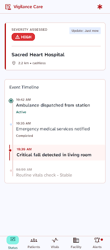
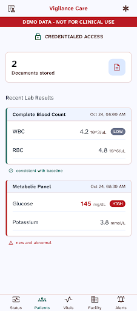
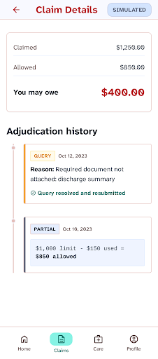
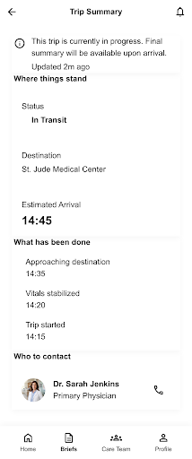
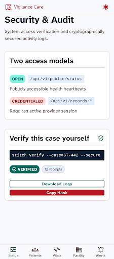
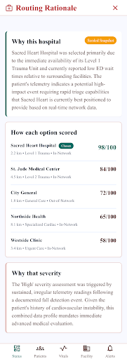

# Design source — Google Stitch

The dashboard at `/app` is built to a design system generated in **Google
Stitch**, not hand-invented. These are the source screens.

| | |
|---|---|
| Project | `Anbu Care dashboard v2` (`projects/8383735353452372653`) |
| Design system | **Vigilant Care** (`assets/6cee5fba64f54068a76a1ffb9bed1e5f`) |

All six screens were designed in Stitch before being built.

| | | |
|---|---|---|
|  |  |  |
| Now | Record | Claim |
|  |  |  |
| Arrival | Audit | Routing |

The arrival screen came from a second project and so carries a different Stitch
system ("Serene Care"). It was **not** adopted wholesale — mixing two systems
would have made the app incoherent. One idea was taken from it: stacking a long
value beneath its label rather than pushing it right, which is what long text
needs on a phone.

## What was taken from Stitch

The **visual language**, faithfully:

- **Atkinson Hyperlegible Next** throughout — a typeface drawn for low-vision
  readers. For a record read by frightened people on a phone that is a real
  argument, not a style choice, and it is the single most opinionated thing
  Stitch contributed.
- Status cards with a **4px colour-coded left edge** (red = severity, teal =
  stable, amber = open item) instead of heavy headers.
- Timeline as a **2px rule with 12px dots**; an alert row gets a tinted
  background and a haloed dot.
- Rows as label-left / value-right with a **pill** carrying the flag.
- Pills for every status; monospace chips for hashes and endpoint paths.
- **Card headings as headings** — bold sentence case with a hairline rule, not
  the 12px uppercase micro-labels the first build used. On a typeface chosen for
  legibility, shouting the labels in 12px caps was working against the point.
- A **page title and one-line subtitle** on every screen. The first build had
  none, which is most of why it read as a debug console.
- **Dark terminal blocks** for anything meant to be run. A pale grey box reads as
  a quotation; a dark one reads as a command.
- **48px minimum touch targets**, 8px spacing base, 16px mobile margins.
- Light warm-neutral surfaces, 1px borders and near-flat elevation rather than
  heavy shadow.

Stitch's own guidance was followed on colour semantics: red is reserved for
severity and alerts, teal carries the chrome and stable states.

## What was NOT taken

Stitch invented plausible clinical content to fill the frames — including
*"Critical fall **detected** in living room"* and an ambulance dispatch.

None of that shipped. Anbu Care has no sensors and detects nothing; an episode
begins when a signal **arrives** from outside. Every value in the built UI comes
from a live endpoint, and the invented copy was discarded wholesale. The design
is Stitch's; the content is the system's.

## Reproducing

The screens above came from `generate_screen_from_text` against a **fresh**
project. Generation against an existing project with a hand-authored design
system timed out repeatedly and produced nothing — worth knowing before
debugging it again.

## Built result, at phone width

`docs/design/mobile/` holds the built screens captured at 402px — what the
family actually sees, as opposed to the Stitch designs above.

`06-arrival-before-fix.png` and `08-arrival-after-fix.png` are the same screen
before and after the long-value fix. Worth keeping the pair: it is the clearest
record of the one real layout bug that only phone width exposed, where a long
explanation was right-aligned and bolded into an unreadable column.

Capture note: `resize_window` does not move the page viewport in this setup —
`innerWidth` stays at desktop. These were taken by forcing the mobile stylesheet
into a 402px column, so the CSS is real but the device is simulated.
